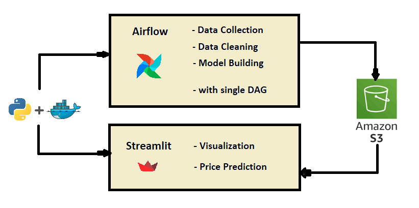
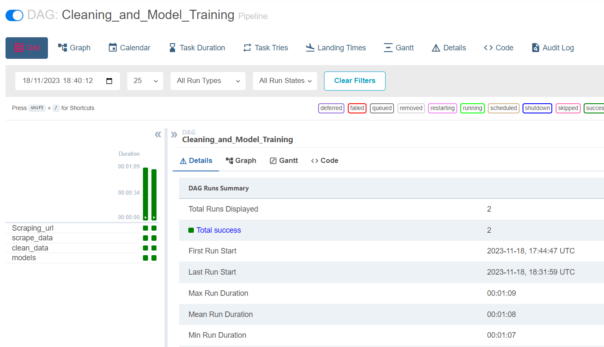
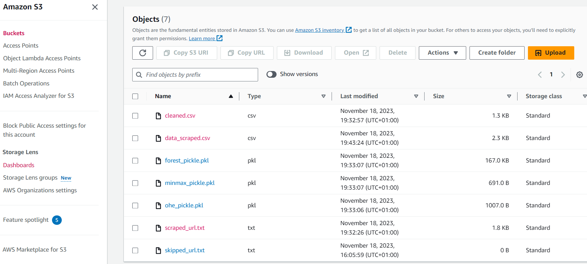
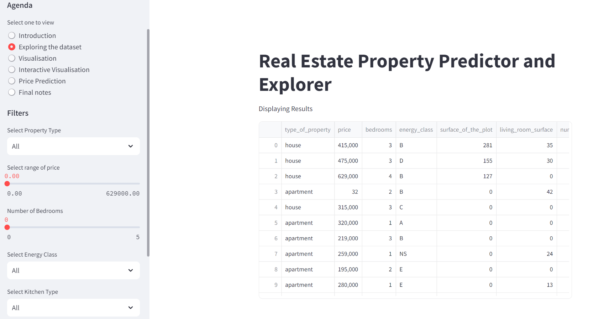
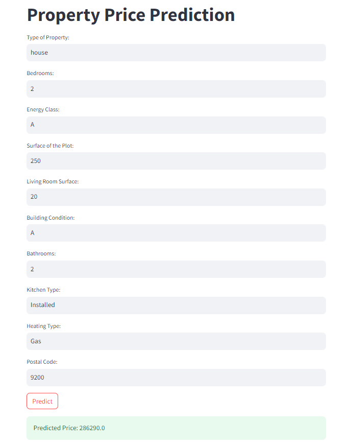

# ETL Pipeline (Docker - Airflow - Streamlit)

## 📖 Table of Contents
1. [Introduction](#introduction) 📌 
2. [Description](#description) 📜 
3. [ETL Pipeline](#pipeline) 📊
5. [Usage](#usage) 🎮 
6. [Completion](#completion) 🏁 

## 📌 Introduction
This project, part of the AI Bootcamp in Gent at BeCode.org, aims to create a pipeline from data cleaning to prediction with data visualization.

## 📜 Description
This project contains series of ETL (Extract, Transform, Load) processes runs within a Docker Compose environment.The workflow is divided into two main steps: Airflow and Streamlit.  

- **Airflow**    
      - Scrape data from houses and appartments on sale  
      - Clean the data with pandas  
      - Train the Machine Learning model  
      - Transfer the data to AWS S3 bucket  
- **Streamlit**  
      - Few visualization of data  
      - Price prediction

## 🔧 Installation  

- Clone this repository.
- Install the required modules using `pip install requirements.txt`

## 📊 ETL Pipeline  
 
#### Airflow
1) Airflow contains one DAG which triggers pipeline containes scraping, cleaning and training model from the scraped data
   

   
2) Airflow uses AWS S3 bucket to store and retrive data  
   

#### Streamlit
1) Visual to explore the data  
   
2) Price prediction  
   

## 🎮 Usage
This can be done by
* Clone the repository
* Open the terminal and redirect to the repository
* Download and install Docker desktop in your machine
* Run `docker-compose up -d`to run docker and respective containers
* Open `http://localhost:8080/` from your browser to view and access airflow UI and its logs. (you can also view logs in logs file that created in repo )
* Open `http://localhost:8501/`to open streamlit for visualisation and prediction

## 🏁 Completion 
Name - Mythili Palanisamy  [LinkedIN](https://www.linkedin.com/in/mythili-aug/)  
Team type - solo
